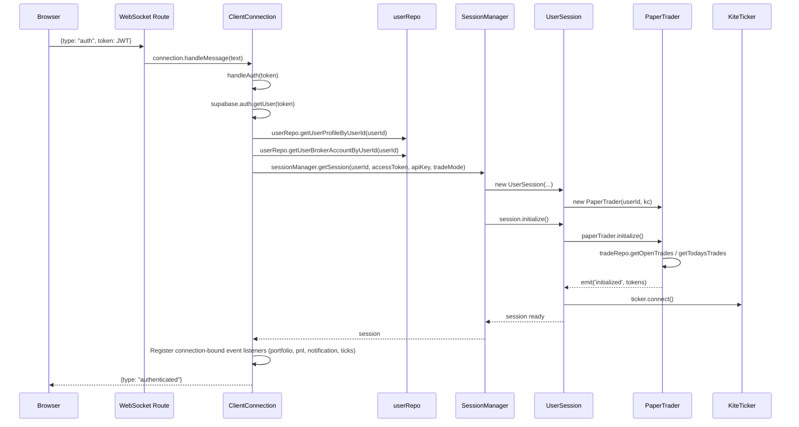

# User Session Evaluation Report

## Overview

This report evaluates the user session creation and initialization flow in the trading-assistant repository. The session system spans three tightly coupled components: `SessionManager`, `UserSession`, and `PaperTrader`, integrated with `ClientConnection` at the WebSocket layer.

---

## Session Architecture

The diagram below reflects the refactored Class-based architecture where individual connections are encapsulated in `ClientConnection` and database operations are consolidated through `userRepo`.

---

## Resolved Issues & Architectural Upgrades

### 1 — `getSession` supports token updates on cache hits (Resolved)

**File**: [`session-manager.ts`](file:///Users/varinder/Documents/projects/ai/personal/trading-assistant/src/execution/session-manager.ts)

* **Problem**: When `getSession` encountered a cache hit, it returned the cached session but never refreshed `KiteConnect` or `KiteTicker` with the new access token. Stale tokens would lead to silent auth errors.
* **Fix**: Implemented `session.updateToken(accessToken, apiKey)` on `UserSession`. When a cache hit occurs, the session compares the tokens. If different, it refreshes `KiteConnect` and `PaperTrader`, disconnects the old ticker, creates a new ticker, and emits the `ticker_recreated` event so that active connections can re-bind.

### 2 — Event Listener Leak & Broadcast Duplication (Resolved)

**File**: [`client-connection.ts`](file:///Users/varinder/Documents/projects/ai/personal/trading-assistant/web/server/utils/client-connection.ts)

* **Problem**: Event listeners were appended globally to `session.paperTrader` and `session.ticker` on every reconnect or new peer authentication. When a user opened multiple browser tabs, duplicate listeners piled up, causing duplicate notifications and duplicate message broadcasts.
* **Fix**: Encapsulated connections in a stateful `ClientConnection` class. Listeners are bound to connection instances. On socket close or error, `destroy()` is invoked, which cleanly removes all connection-bound listeners from `UserSession.paperTrader` and `UserSession.ticker`.

### 3 — `PaperTrader.initialize()` Swallowed Failures (Resolved)

**File**: [`paper-trader.ts`](file:///Users/varinder/Documents/projects/ai/personal/trading-assistant/src/execution/paper-trader.ts)

* **Problem**: Database lookups (like `getOpenTrades`) that failed during initialization were caught and logged, but never re-thrown. `initialized` remained `false`, causing silent failures and infinite loop retries.
* **Fix**: Modified `PaperTrader.initialize()` to re-throw any caught errors. This propagates the failure back to the web/endpoint layers so the caller is immediately notified of initialization failures.

### 4 & 5 — `analyze` and `square-off` Endpoints missing TradeMode / ApiKey (Resolved)

**Files**: [`analyze.post.ts`](file:///Users/varinder/Documents/projects/ai/personal/trading-assistant/web/server/api/analyze.post.ts), [`square-off.post.ts`](file:///Users/varinder/Documents/projects/ai/personal/trading-assistant/web/server/api/square-off.post.ts)

* **Problem**: Both endpoints retrieved the user session using `getSession` but skipped passing `tradeMode` and/or `apiKey`, causing them to default to `PAPER` mode even if the user profile configuration was set to `REAL`.
* **Fix**: Configured both endpoints to fetch the user profile's `tradeMode` and the broker account's `apiKey` via `userRepo`, and pass them explicitly to `getSession`.

### 6 — Auto-reconnect lost Watched Symbol subscriptions (Resolved)

**File**: [`client-connection.ts`](file:///Users/varinder/Documents/projects/ai/personal/trading-assistant/web/server/utils/client-connection.ts)

* **Problem**: On `KiteTicker` reconnect, only position tokens were resubscribed; the watched index/stock token (e.g. NIFTY) was not resubscribed, causing live ticks to cease flowing until the user manually watched the symbol again.
* **Fix**: Added an `onTickerConnect` listener in `ClientConnection`. When `KiteTicker` reconnects or gets recreated, the connection re-subscribes to its active watched symbol `this.token`.

### 7 — Repository Instantiation Tight Coupling (Resolved)

**Files**: Repository files under [`src/db/repositories/`](file:///Users/varinder/Documents/projects/ai/personal/trading-assistant/src/db/repositories)

* **Problem**: Repository singletons were created and exported inside their implementation files, making constructor-based dependency injection impossible and testing/mocking difficult.
* **Fix**: Converted `UserRepository`, `TradeRepository`, `GtiRepository`, and `EventRepository` to classes that accept Kysely `db` via constructor parameters. Created a central Composition Root ([container.ts](file:///Users/varinder/Documents/projects/ai/personal/trading-assistant/src/db/repositories/container.ts)) to instantiate and export singleton repository instances.

---

## Fixes Summary

All identified architectural critical bugs and concerns are fully resolved:

| # | Severity | Component | Fix Description | Status |
|---|----------|-----------|-----------------|--------|
| 1 | 🔴 Critical | `session-manager.ts` | Refreshes `kc`/`ticker` using `updateToken()` on cache hit | **Resolved** |
| 2 | 🔴 Critical | `client-connection.ts` | Unbinds connection-specific event listeners on socket destroy | **Resolved** |
| 3 | 🟠 High | `paper-trader.ts` | Re-throws initialization errors to caller | **Resolved** |
| 4 | 🟠 High | `analyze.post.ts` | Looks up and passes correct `tradeMode` to session | **Resolved** |
| 5 | 🟠 High | `square-off.post.ts` | Pass `apiKey` and `tradeMode` to session | **Resolved** |
| 6 | 🟡 Medium | `client-connection.ts` | Re-subscribes watched symbol on ticker reconnect | **Resolved** |
| 7 | 🟡 Medium | Repositories | Decoupled object instantiation via Composition Root DI | **Resolved** |
