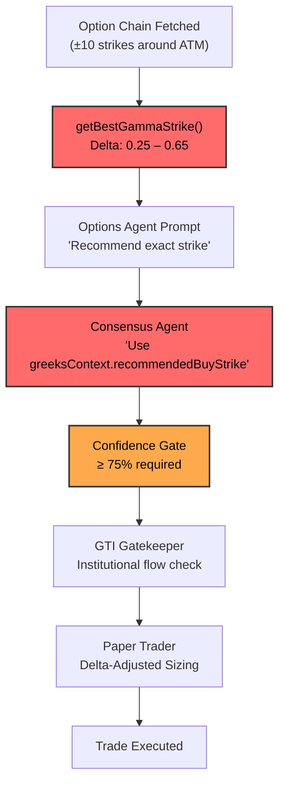

# 🔍 Why The System Only Trades Deep ITM Strikes — Full Audit

## Executive Summary

After a thorough scan of all prompts, strike selection logic, Greeks computations, ensemble AI pipeline, and execution engine, I've identified **7 compounding factors** that push the system toward deep ITM strikes and excessive conservatism. **None of these are bugs individually** — they are well-intentioned safety rails that, when stacked together, create an overly restrictive system that suffocates profit potential.

---

## 🏗️ Architecture Flow (How a Strike Gets Selected)



---

## 🚨 Root Cause Analysis: 7 Compounding Conservatism Layers

### Loophole #1: `getBestGammaStrike()` — The Delta Filter Is Too Narrow (THE CORE ISSUE)

**File:** [kite-options.ts](file:///Users/varinder/Documents/projects/ai/personal/trading-assistant/src/analysis/kite-options.ts#L245-L260)

```typescript
const getBestGammaStrike = (optionRows: KiteOptionOiRow[]) => {
    const validRows = optionRows.filter(r => {
       if (!r.greeks) return false;
       const absDelta = Math.abs(r.greeks.delta);
       return absDelta >= 0.25 && absDelta <= 0.65;  // ← THIS IS THE PROBLEM
    });
```

**Impact:** The `0.25 – 0.65` delta filter is intended to avoid deep OTM and deep ITM. But:

- On **0DTE/1DTE**, Gamma is highest at ATM (delta ~0.50), so the filter naturally converges to ATM or slightly ITM.
- On expiry weeks with **2-4 DTE**, the optimal Gamma/Premium ratio shifts toward slightly OTM strikes (delta 0.15-0.30), which are completely **excluded** by this filter.
- The `Gamma / Premium` ratio used for selection inherently favors **lower premium** (OTM/ATM) options. But the 0.25 delta floor blocks the cheapest, highest-gamma options. So the optimizer is forced to choose from a narrow band that ends up being **slightly ITM** (delta 0.50-0.65).

> [!WARNING]
> The 0.65 cap actually forces deep ITM when combined with the next issue. A CE with delta 0.65 at NIFTY 24000 means selecting a 23750 or 23800 strike — which IS deep ITM. The filter is doing exactly what you described.

---

### Loophole #2: Consensus Prompt Hard-Codes "Use the Recommended Strike" — No Room for Deviation

**File:** [prompts.ts](file:///Users/varinder/Documents/projects/ai/personal/trading-assistant/src/ai/prompts.ts#L146-L147)

```
10. **STRIKE SELECTION:**
    - If authorizing a trade, you MUST select the exact strike recommended by the
      Options Specialist or the `greeksContext.recommendedBuyStrike`. This strike is
      mathematically optimized for the best Gamma/Premium ratio to catch explosive moves.
      Do not invent your own strike.
```

**Impact:** The LLM has **zero discretion** to select an alternative strike. Even if the Technical Agent identifies a clear Wave 3 breakout where an ATM/slightly OTM strike would give far better percentage returns, the Consensus Agent is **hard-coded** to parrot back the `getBestGammaStrike()` output. This turns the LLM into a rubber-stamp for the algorithmic selection.

---

### Loophole #3: IV Crush Protection Blocks ALL Buys When IVR > 70%

**File:** [prompts.ts](file:///Users/varinder/Documents/projects/ai/personal/trading-assistant/src/ai/prompts.ts#L142-L143)

```
8. **IV CRUSH PROTECTION RULE:**
   - If the "ivRank" in the options analysis is > 70%, DO NOT authorize any BUY trades
     (BUY_CE or BUY_PE) because the risk of IV crush is too high.
```

**Impact:** This is a blanket ban. During high-volatility trend days (exactly when NIFTY makes 200-300pt moves), IVR naturally spikes above 70%. The system **refuses to trade the best days** because IV is high — even though deep ITM options (which it prefers!) are least affected by IV crush due to their high intrinsic value and low vega. This is internally contradictory:

- The system selects deep ITM strikes (low vega, low IV sensitivity)
- But then refuses to trade when IV is high (which only matters for OTM/ATM strikes)

> [!IMPORTANT]
> **The IV Crush rule should be applied to OTM/ATM strikes only, not deep ITM.** Deep ITM options have delta ~0.7+ and vega near zero — IV crush barely affects them.

---

### Loophole #4: Theta Decay Rule Blocks 0DTE Trades in Consolidation

**File:** [prompts.ts](file:///Users/varinder/Documents/projects/ai/personal/trading-assistant/src/ai/prompts.ts#L144-L145)

```
9. **THETA DECAY PROTECTION RULE:**
   - If `greeksContext.daysToExpiry` < 1 (0DTE/1DTE) AND the market is in a structural
     consolidation (Wave 4 or choppy ORB), DO NOT authorize BUY_CE or BUY_PE.
```

**Impact:** On 0DTE/1DTE (which is most NIFTY weekly expiry trading), any consolidation pattern triggers this rule. Wave 4 consolidations often **precede the most explosive Wave 5 breakouts**, but the system refuses to participate in them. Combined with the fact that NIFTY options are weekly expiry, this rule effectively blocks trades for ~30-40% of market hours on expiry day.

---

### Loophole #5: Confidence Gate at 75% + Multiple Opposing Filters = Chronic NO_TRADE

**File:** [trade.ts](file:///Users/varinder/Documents/projects/ai/personal/trading-assistant/src/analysis/trade.ts#L270-L274)

```typescript
if (normalizedConfidence < 75) {
  console.log(`[Analysis] Signal REJECTED: Confidence ${normalizedConfidence}% is below threshold (75%).`)
  aiDecision.decision = 'HOLD'
  aiDecision.optionAction = 'NONE'
}
```

Combined with:

- Consensus Agent Rule 4: Divergence → NO_TRADE (unless >90% confidence)
- Consensus Agent Rule 5: Negative sentiment + bullish technicals → reduce confidence
- Consensus Agent Rule 6: HARD OPTIONS RULES (flow must perfectly align)
- Consensus Agent Rule 7: Reversal Quality Score < 3/5 → NO_TRADE

**Impact:** The Consensus Agent is wired to be pessimistic. It requires:

1. Technical and Options agents fully aligned ✅
2. Sentiment not contradicting ✅
3. IV Rank < 70% ✅
4. Not 0DTE consolidation ✅
5. Reversal score ≥ 3/5 (if reversal) ✅
6. Options flow perfectly aligned ✅
7. GTI not opposing ✅
8. Overall confidence ≥ 75% ✅

**Getting ALL 8 conditions to pass simultaneously is extremely rare.** Each individual filter is reasonable, but stacking them multiplicatively means the probability of a trade signal drops exponentially.

---

### Loophole #6: GTI Gatekeeper Adds Another Layer of Vetoing

**File:** [trade.ts](file:///Users/varinder/Documents/projects/ai/personal/trading-assistant/src/analysis/trade.ts#L277-L292)

```typescript
const gtiGatekeeperThreshold = -0.3
if (gtiScore.confidence > 30) {
  const gtiOpposing =
    (isBuySignal && gtiScore.composite < gtiGatekeeperThreshold) ||
    (isSellSignal && gtiScore.composite > -gtiGatekeeperThreshold)
  if (gtiOpposing) {
    aiDecision.decision = 'HOLD'
    aiDecision.optionAction = 'NONE'
  }
}
```

**Impact:** Even after the AI ensemble approves a trade with 80%+ confidence, the GTI gatekeeper can **veto it at the last moment**. The threshold of ±0.3 is relatively easy to trigger, especially during choppy markets where institutional flow oscillates. This creates a "double veto" system — first the AI can say NO_TRADE, then GTI can block it even if the AI says YES.

---

### Loophole #7: Memory Service Creates Loss Aversion Bias

**File:** [memory.ts](file:///Users/varinder/Documents/projects/ai/personal/trading-assistant/src/ai/memory.ts#L75-L92)

```typescript
formatForPrompt(stats: RegimeStats | null): string {
    // Shows past trades with "SUCCESS" or "FAILURE" labels
    prompt += `   Outcome: ${pnl && pnl > 0 ? "SUCCESS" : "FAILURE"}\n\n`;
}
```

**Impact:** When past trades in similar regimes have been losers, the LLM sees:

```
Outcome: FAILURE
Outcome: FAILURE
Win Rate: 33.3%
```

This creates a **negative reinforcement loop** — the AI becomes hesitant to take similar setups even when the current opportunity is valid. Loss aversion is baked into the prompt via the memory context.

---

## 📊 The Conservatism Stack (Visualized)

| Layer        | Filter                       | Effect                   | Kill Rate                        |
| ------------ | ---------------------------- | ------------------------ | -------------------------------- |
| 1            | VIX > 25                     | Complete circuit breaker | ~5% of sessions                  |
| 2            | Cooldown (15 min after exit) | Blocks re-entry          | ~20% of signals                  |
| 3            | IVR > 70%                    | Blocks ALL buys          | ~15-25% of volatile sessions     |
| 4            | 0DTE + Consolidation         | Blocks buys              | ~30-40% of expiry day hours      |
| 5            | Reversal Score < 3/5         | Blocks Playbook B        | ~50% of reversal setups          |
| 6            | Confidence < 75%             | Blocks trade             | ~40-60% of AI signals            |
| 7            | GTI Opposing                 | Final veto               | ~10-15% of remaining signals     |
| 8            | Options Flow misalignment    | HARD RULES veto          | ~20% of remaining signals        |
| **Combined** | **All layers stacked**       | **Net pass-through**     | **~2-5% of total opportunities** |

> [!CAUTION]
> The system is designed to let through only about **2-5% of potential trading opportunities**. While each individual filter is defensible, their multiplicative stacking means the system spends 95%+ of its time saying NO_TRADE.

---

## 🔧 Recommended Fixes (Prioritized)

### Fix 1: Widen the Delta Band for Strike Selection (HIGH IMPACT)

In [kite-options.ts](file:///Users/varinder/Documents/projects/ai/personal/trading-assistant/src/analysis/kite-options.ts#L247-L250), widen the filter and make it DTE-aware:

```diff
- return absDelta >= 0.25 && absDelta <= 0.65;
+ // DTE-aware: Wider band for longer expiries, tighter for 0DTE
+ const minDelta = daysToExpiry < 1 ? 0.35 : 0.20;
+ const maxDelta = daysToExpiry < 1 ? 0.55 : 0.70;
+ return absDelta >= minDelta && absDelta <= maxDelta;
```

This targets the true Gamma sweet spot: ATM for 0DTE (where Gamma is king), and slightly OTM for multi-day (where leverage is better).

### Fix 2: Give the Consensus Agent Strike Discretion (HIGH IMPACT)

In [prompts.ts](file:///Users/varinder/Documents/projects/ai/personal/trading-assistant/src/ai/prompts.ts#L146-L147):

```diff
- Do not invent your own strike.
+ Use the recommended strike as a default, but you MAY select a different
+ strike within ±2 strikes of ATM if the current setup strongly favors it
+ (e.g., a clear Wave 3 breakout favors an ATM strike for maximum gamma).
```

### Fix 3: Make IV Crush Rule Delta-Aware (MEDIUM IMPACT)

In [prompts.ts](file:///Users/varinder/Documents/projects/ai/personal/trading-assistant/src/ai/prompts.ts#L142-L143):

```diff
- DO NOT authorize any BUY trades (BUY_CE or BUY_PE)
+ DO NOT authorize BUY trades for strikes with absolute delta < 0.55
+ (OTM/ATM options are vulnerable to IV crush). Deep ITM options
+ (delta > 0.55) can still be authorized as IV crush minimally impacts them.
```

### Fix 4: Lower the Confidence Threshold or Use Tiered Sizing (MEDIUM IMPACT)

Instead of a hard 75% cutoff, use tiered position sizing:

```diff
- if (normalizedConfidence < 75) {
+ if (normalizedConfidence < 60) {
    // Below 60% = definitely reject
+ } else if (normalizedConfidence < 75) {
+   // 60-75% = take the trade but with reduced position (1 lot only)
+   aiDecision.reducedPosition = true;
+ } else {
    // 75%+ = full conviction, standard sizing
```

### Fix 5: Make GTI a Confidence Modifier, Not a Veto (MEDIUM IMPACT)

Instead of blocking the trade entirely:

```diff
- aiDecision.decision = "HOLD";
- aiDecision.optionAction = "NONE";
+ // Reduce confidence instead of blocking
+ aiDecision.confidence = Math.max(50, aiDecision.confidence * 0.7);
+ aiDecision.reason = `[GTI WARNING] ${aiDecision.reason} | Caution: Institutional flow may oppose.`;
```

### Fix 6: Remove or Soften Theta Decay Rule for ITM Strikes (LOW IMPACT)

Deep ITM options have minimal extrinsic value, so Theta decay is minimal. The rule should only apply to ATM/OTM:

```diff
- DO NOT authorize BUY_CE or BUY_PE.
+ DO NOT authorize BUY_CE or BUY_PE for ATM/OTM strikes.
+ Deep ITM options (delta > 0.60) may still be authorized as their
+ premium is mostly intrinsic value and Theta decay is negligible.
```

### Fix 7: Reframe Memory Output to Avoid Loss Aversion

```diff
- prompt += `   Outcome: ${pnl && pnl > 0 ? "SUCCESS" : "FAILURE"}\n\n`;
+ prompt += `   Outcome: ${pnl && pnl > 0 ? "PROFIT" : "LOSS"} (${pnl.toFixed(2)})\n`;
+ // Add: "Note: Past losses in similar conditions may indicate regime unsuitability,
+ //  but do NOT let them reduce confidence if the current technical setup is valid."
```

---

## 🎯 The Core Paradox

The system has an **internal contradiction**:

1. The **strike selector** (`getBestGammaStrike`) optimizes for Gamma/Premium ratio → this naturally picks strikes with **high gamma** (near ATM)
2. But the **delta filter** (0.25-0.65) and the tendency of the Consensus Agent to play it safe pushes toward **higher delta** (ITM, 0.50-0.65)
3. Then the **IV Crush rule** blocks all buys when IV is high — but **ITM options are the safest during IV crush** because they have low vega
4. And the **Theta rule** blocks 0DTE consolidation trades — but **ITM options lose the least theta** because their premium is mostly intrinsic

**The system built walls to protect against risks that don't apply to the very strikes it selects.** It's like wearing a life jacket in the desert because it passed through a harbor on the way there.

---

## 💡 Quick Win: Single Change with Maximum Impact

If you want **one change** that has the biggest effect: **modify the delta filter in `getBestGammaStrike()`** to be DTE-aware and target ATM more aggressively on 0DTE days. This single change flows through the entire pipeline since the Consensus Agent is instructed to use this strike.

The current `0.25-0.65` band → change to `0.40-0.55` for 0DTE, `0.20-0.50` for 2+ DTE. This will naturally select ATM/slightly OTM strikes with maximum gamma leverage instead of deep ITM strikes.
