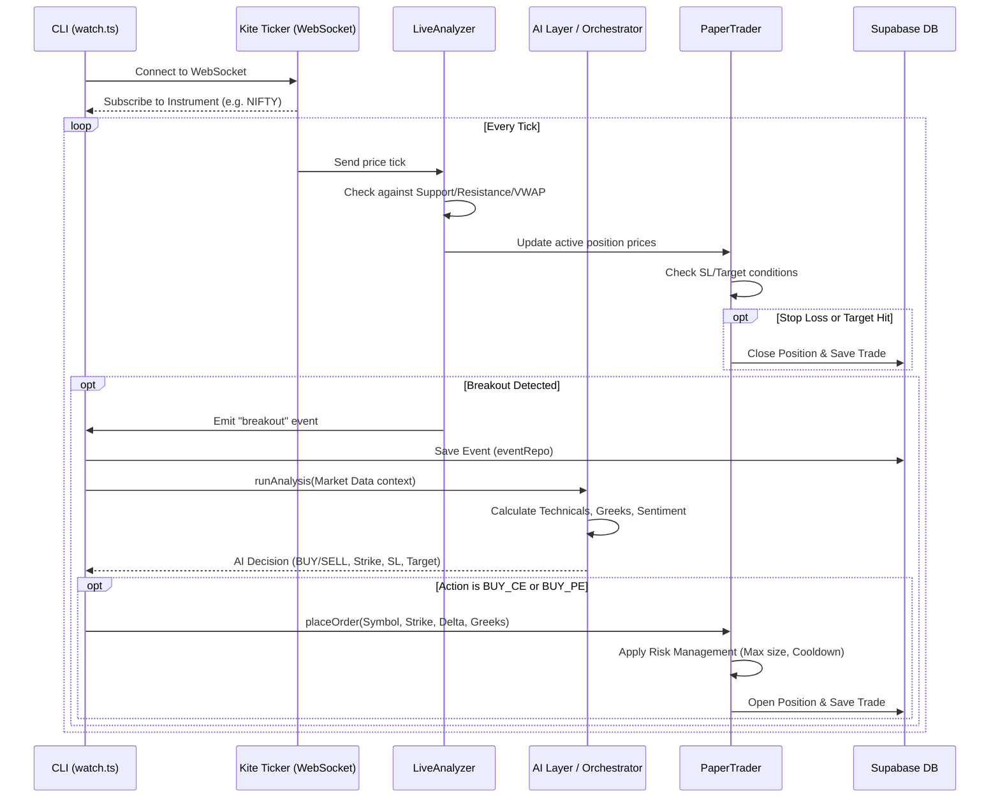
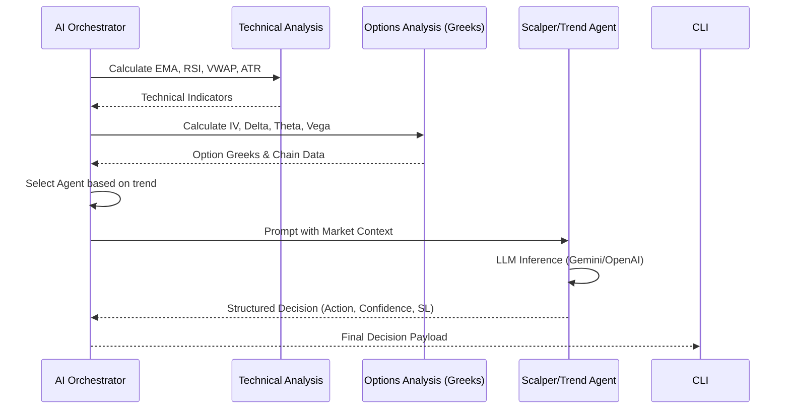

# Trading Engine Flow (CLI Watch Mode)

## Real-time Monitoring & Order Execution

```mermaid
sequenceDiagram
    participant CLI as CLI (watch.ts)
    participant Kite as Kite Ticker (WebSocket)
    participant Analyzer as LiveAnalyzer
    participant AI as AI Layer / Orchestrator
    participant Trader as PaperTrader
    participant DB as Supabase DB

    CLI->>Kite: Connect to WebSocket
    Kite-->>CLI: Subscribe to Instrument (e.g. NIFTY)

    loop Every Tick
        Kite->>Analyzer: Send price tick
        Analyzer->>Analyzer: Check against Support/Resistance/VWAP
        Analyzer->>Trader: Update active position prices
        Trader->>Trader: Check SL/Target conditions

        opt Stop Loss or Target Hit
            Trader->>DB: Close Position & Save Trade
        end

        opt Breakout Detected
            Analyzer->>CLI: Emit "breakout" event
            CLI->>DB: Save Event (eventRepo)

            CLI->>AI: runAnalysis(Market Data context)
            AI->>AI: Calculate Technicals, Greeks, Sentiment
            AI-->>CLI: AI Decision (BUY/SELL, Strike, SL, Target)

            opt Action is BUY_CE or BUY_PE
                CLI->>Trader: placeOrder(Symbol, Strike, Delta, Greeks)
                Trader->>Trader: Apply Risk Management (Max size, Cooldown)
                Trader->>DB: Open Position & Save Trade
            end
        end
    end
```

## AI Agent Decision Flow

```mermaid
sequenceDiagram
    participant Orchestrator as AI Orchestrator
    participant Tech as Technical Analysis
    participant Options as Options Analysis (Greeks)
    participant Agent as Scalper/Trend Agent

    Orchestrator->>Tech: Calculate EMA, RSI, VWAP, ATR
    Tech-->>Orchestrator: Technical Indicators
    Orchestrator->>Options: Calculate IV, Delta, Theta, Vega
    Options-->>Orchestrator: Option Greeks & Chain Data
    Orchestrator->>Orchestrator: Select Agent based on trend

    Orchestrator->>Agent: Prompt with Market Context
    Agent->>Agent: LLM Inference (Gemini/OpenAI)
    Agent-->>Orchestrator: Structured Decision (Action, Confidence, SL)
    Orchestrator-->>CLI: Final Decision Payload
```
