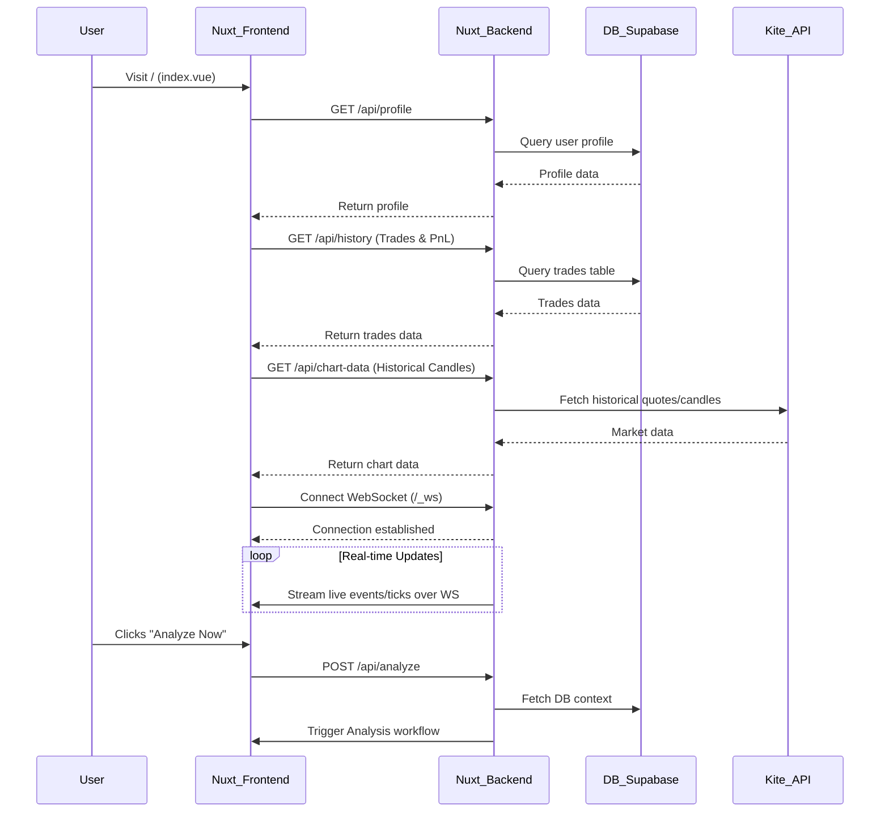
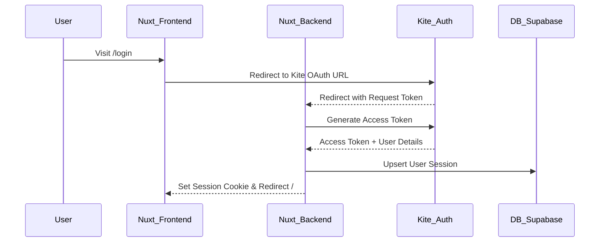

# Web Application Flow

## Dashboard Initialization

```mermaid
sequenceDiagram
    participant User
    participant Nuxt_Frontend
    participant Nuxt_Backend
    participant DB_Supabase
    participant Kite_API

    User->>Nuxt_Frontend: Visit / (index.vue)
    Nuxt_Frontend->>Nuxt_Backend: GET /api/profile
    Nuxt_Backend->>DB_Supabase: Query user profile
    DB_Supabase-->>Nuxt_Backend: Profile data
    Nuxt_Backend-->>Nuxt_Frontend: Return profile
    
    Nuxt_Frontend->>Nuxt_Backend: GET /api/history (Trades & PnL)
    Nuxt_Backend->>DB_Supabase: Query trades table
    DB_Supabase-->>Nuxt_Backend: Trades data
    Nuxt_Backend-->>Nuxt_Frontend: Return trades data
    
    Nuxt_Frontend->>Nuxt_Backend: GET /api/chart-data (Historical Candles)
    Nuxt_Backend->>Kite_API: Fetch historical quotes/candles
    Kite_API-->>Nuxt_Backend: Market data
    Nuxt_Backend-->>Nuxt_Frontend: Return chart data
    
    Nuxt_Frontend->>Nuxt_Backend: Connect WebSocket (/_ws)
    Nuxt_Backend-->>Nuxt_Frontend: Connection established
    
    loop Real-time Updates
        Nuxt_Backend->>Nuxt_Frontend: Stream live events/ticks over WS
    end

    User->>Nuxt_Frontend: Clicks "Analyze Now"
    Nuxt_Frontend->>Nuxt_Backend: POST /api/analyze
    Nuxt_Backend->>DB_Supabase: Fetch DB context
    Nuxt_Backend->>Nuxt_Frontend: Trigger Analysis workflow
```

## Authentication Flow

```mermaid
sequenceDiagram
    participant User
    participant Nuxt_Frontend
    participant Nuxt_Backend
    participant Kite_Auth
    participant DB_Supabase

    User->>Nuxt_Frontend: Visit /login
    Nuxt_Frontend->>Kite_Auth: Redirect to Kite OAuth URL
    Kite_Auth-->>Nuxt_Backend: Redirect with Request Token
    Nuxt_Backend->>Kite_Auth: Generate Access Token
    Kite_Auth-->>Nuxt_Backend: Access Token + User Details
    Nuxt_Backend->>DB_Supabase: Upsert User Session
    Nuxt_Backend-->>Nuxt_Frontend: Set Session Cookie & Redirect /
```
