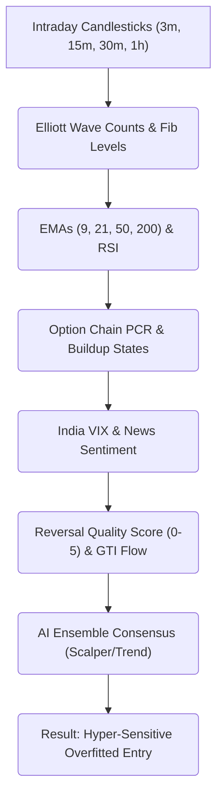

# 📊 Financial Advisory Audit & System Improvement Plan

## 1. Executive Summary

As a Financial Advisor reviewing this automated trading system, I must present a critical and urgent evaluation: **the system is currently designed to fail slowly by taking many small, unnecessary losses.** 

Over the past 15 days (June 24, 2026, to July 8, 2026), the system executed **16 trades**, resulting in **15 losses and only 1 profit** (which was a manual panic sell). The total realized loss stands at **-15,992.60 INR**, with a dismal **win rate of 6.25%**. 

This failure is not due to an adverse market. During this exact period, the Nifty 50 index rose steadily from **24,021.65** (June 24) to **24,398.70** (July 7)—a net upward movement of **+377 points (+1.57%)**. Yet, the system lost money on **every single Call Option (CE) trade** it took.

### The Advisor's Verdict: Over-Analysis & Structural Mismatches
The system suffers from **over-analysis (overfitting)** and **severe execution defects**:
1. **Analysis Paralysis & Late Entries:** Stacking 8+ complex parameters forces the system to enter trends extremely late (often at overbought RSI levels of 75–85) when pullbacks are imminent.
2. **The Delta-Mismatch Bug:** The system translates index stop-losses into option premium stop-losses assuming a fixed delta of `0.5`, but it trades **Deep ITM options** (delta `0.90+`). As a result, the option stop-loss is hit on minor index pullbacks, stopping the trade out prematurely before the index invalidation level is ever reached.
3. **Ghost Trading Outside Market Hours:** The position manager evaluates trades 24/7 (including at 4:00 AM IST) on stale, closed-market quotes. The AI agents, over-analyzing static data, trigger erroneous exits and stop-outs before the market even opens.
4. **Programmatic Math Hallucinations (EWT & Fibs):** Asking the LLM to count Elliott Waves and calculate Fibonacci numbers on the fly results in garbage coordinates and invalid stop-losses (e.g. `indexSl: 4`). 

---

## 2. Critique of Technical Over-Analysis

In quantitative finance, the more variables you stack, the more you **overfit** the model to historical noise. This system is a textbook case of over-analysis:



### Why Elliott Wave Theory (EWT) Fails in Prompt Instructions
While EWT is conceptually powerful for projecting targets and identifying trend maturity on daily/weekly charts, **forcing an LLM to count waves on 3m/15m charts is a critical error**:
1. **Intraday Noise vs. Rigid Wave Rules:** Intraday charts are filled with noise (news spikes, order blocks, stop runs). A single 3-minute wick can violate the "Wave 4 cannot overlap Wave 1" rule. This invalidates the EWT count mathematically, prompting the system to dump a perfectly healthy position before the actual trend resumes.
2. **LLM Arithmetic Limitations:** LLMs are statistical text generators, not calculators. Asking them to sequentially identify swing points, verify wave heights, apply EWT guidelines, and calculate Fibonacci retracements leads directly to hallucinated values.
3. **The Solution (Offloading Math to Code):** EWT and Fibonacci calculations are **purely mathematical**. They must be computed by **deterministic TypeScript code** and passed to the LLM as static facts (e.g. `fib618Support: 24100`, `wavePhase: "WAVE_3"`). The LLM should only act as the *Executive Consensus*, not the *Calculator*.

---

## 3. Trade History Audit (Past 15 Days)

Below is the complete ledger of the 16 trades executed by the system between June 24 and July 8, 2026:

| Trade ID | Symbol | Opened At (IST) | Closed At (IST) | Qty | Entry Price | Exit Price | PnL (INR) | Exit Reason | Agent | Setup | Key Technical Indicators |
| :--- | :--- | :--- | :--- | :--- | :--- | :--- | :--- | :--- | :--- | :--- | :--- |
| `b6dcb67a` | `NIFTY2671424000PE` | Jul 08, 04:16 AM | Jul 08, 05:12 AM | 65 | 66.85 | 48.25 | **-1,209.00** | Stop-Loss | SCALPER | INSTITUTIONAL_TRAP | RSI 16.54, VIX 12.4 |
| `7181e63e` | `NIFTY2670724450PE` | Jul 07, 09:55 AM | Jul 07, 10:31 AM | 65 | 51.85 | 51.30 | **-35.75** | Stop-Loss | TREND | INSTITUTIONAL_TRAP | RSI 57.24, VIX 11.71 |
| `5abe002e` | `NIFTY2670724050CE` | Jul 07, 07:02 AM | Jul 07, 07:25 AM | 65 | 416.40 | 400.00 | **-1,066.00** | Stop-Loss | SCALPER | TREND_CONTINUATION | RSI 49.59, VIX 11.69 |
| `3341f997` | `NIFTY2670724050CE` | Jul 07, 06:37 AM | Jul 07, 06:46 AM | 65 | 462.00 | 437.60 | **-1,586.00** | Stop-Loss | SCALPER | TREND_CONTINUATION | RSI 49.59, VIX 11.75 |
| `683e4182` | `NIFTY2670724050CE` | Jul 03, 04:01 AM | Jul 03, 08:03 AM | 65 | 329.45 | 273.30 | **-3,649.75** | Stop-Loss | TREND | TREND_CONTINUATION | RSI 85.00, VIX 12.01 |
| `7908ac4d` | `ICICIBANK26JUL1400CE`| Jul 03, 03:53 AM | Jul 03, 04:00 AM | 700| 39.15 | 42.10 | **+2,065.00**| Manual Exit | TREND | TRUE_BREAKOUT | RSI 79.63, VIX 12.07 |
| `3f6fe4ba` | `NIFTY2670724050CE` | Jul 02, 06:59 AM | Jul 02, 07:25 AM | 65 | 177.00 | 167.85 | **-594.75** | Stop-Loss | TREND | TRUE_BREAKOUT | RSI 70.30, VIX 12.56 |
| `d3c9705f` | `NIFTY2670723850PE` | Jul 02, 04:45 AM | Jul 02, 05:42 AM | 65 | 45.45 | 37.90 | **-490.75** | Stop-Loss | TREND | INSTITUTIONAL_TRAP | RSI 55.94, VIX 12.86 |
| `3d6d845e` | `NIFTY2670724050CE` | Jul 02, 04:03 AM | Jul 02, 04:38 AM | 65 | 192.70 | 157.55 | **-2,284.75** | Stop-Loss | SCALPER | INSTITUTIONAL_TRAP | RSI 68.14, VIX 12.88 |
| `8fb5c471` | `NIFTY2670724050CE` | Jul 01, 06:49 AM | Jul 01, 09:09 AM | 65 | 156.55 | 136.70 | **-1,290.25** | Stop-Loss | SCALPER | INSTITUTIONAL_TRAP | RSI 73.41, VIX 13.42 |
| `63ed6fcf` | `NIFTY26JUN23550CE` | Jun 30, 06:45 AM | Jun 30, 06:50 AM | 65 | 388.65 | 384.00 | **-302.25** | Stop-Loss | TREND | TREND_CONTINUATION | RSI 47.46, VIX 13.39 |
| `cf3e9289` | `NIFTY26JUN23550CE` | Jun 30, 05:07 AM | Jun 30, 05:14 AM | 65 | 360.10 | 348.05 | **-783.25** | Stop-Loss | SCALPER | TRUE_BREAKOUT | RSI 42.79, VIX 13.71 |
| `0c07924b` | `NIFTY26JUN23550CE` | Jun 29, 03:51 AM | Jun 29, 04:02 AM | 65 | 556.20 | 500.00 | **-3,653.00** | Stop-Loss | TREND | TREND_CONTINUATION | RSI 32.27, VIX 13.53 |
| `824597a8` | `HDFCBANK26JUN795CE` | Jun 25, 09:40 AM | Jun 25, 09:55 AM | 550| 6.55 | 6.35 | **-110.00** | Market Close| SCALPER | TREND_CONTINUATION | RSI 27.92, VIX 13.06 |
| `d01e1933` | `NIFTY26JUN23550CE` | Jun 25, 08:06 AM | Jun 25, 08:33 AM | 65 | 662.00 | 647.00 | **-975.00** | Stop-Loss | SCALPER | TREND_CONTINUATION | RSI 56.27, VIX 12.96 |
| `a59ff999` | `NIFTY26JUN24050CE` | Jun 24, 07:58 AM | Jun 24, 09:30 AM | 1 | 157.10 | 129.95 | **-27.15** | Stop-Loss | TREND | TRUE_BREAKOUT | RSI 77.37, VIX 13.63 |

### Performance Metrics:
* **Total Realized PnL:** -15,992.60 INR
* **Win Rate:** 6.25% (1/16 trades)
* **Average Loss:** -1,137.17 INR
* **Average Win:** +2,065.00 INR
* **Call Option (CE) Win Rate:** 0.00% (0/12 trades)

---

## 4. Deep-Dive Case Studies & Market Grounding

To understand why the analysis was incorrect on specific trades, we examine two critical periods using actual historical market data:

### Case Study 1: The July 7, 2026 Whipsaw (Trades 1, 2, 3, and 4)
* **The Setup:** The system took **4 separate trades** in both directions on Nifty index options. It bought Call Options early in the morning (Trades 3 and 4), reversed to buy a Put Option (Trade 2) in the late morning, and then bought another Put Option (Trade 1) after-hours.
* **The Result:** All 4 trades were stopped out, resulting in a net loss of **-3,896.75 INR**.
* **Market Reality (July 7, 2026):**
  * Nifty opened at **24,420** and closed at **24,398.70 (-0.13%)**, trading in a narrow intraday range of **40 points**.
  * The India VIX was extremely low at **11.71**, indicating a complete lack of market fear or volatility.
  * This was a **sideways, low-volatility consolidation day**.
* **The Analytical Failure:**
  * The system over-analyzed micro-movements on the 3-minute and 15-minute charts. It interpreted normal range fluctuations as "institutional traps" and "Wave 5 launchpads."
  * Buying option premiums on a low-volatility, sideways consolidation day is a mathematical error. Because the index remained range-bound, theta decay and minor fluctuations triggered the stop-losses on both Call and Put contracts. The system failed to realize that **consolidation periods do not support breakout strategies**.

### Case Study 2: July 1–2, 2026 Trend-Chasing Losses (Trades 5, 7, 9, and 10)
* **The Setup:** The system entered multiple Call (CE) positions (`NIFTY2670724050CE`) expecting major breakouts.
* **The Result:** The system was stopped out on all Call trades, losing a combined **-7,809.75 INR**.
* **Market Reality (July 1–2, 2026):**
  * The market was **strongly bullish**. Nifty closed up **+0.59%** on July 1 and up **+0.71%** on July 2, breaking above 24,100.
* **The Analytical Failure:**
  * **Buying at Extreme Overbought Levels:** In Trade 5, the system bought CE when the 15-minute RSI was **85.00** (extremely overbought). Because the model waited for all 8+ indicators to align, it entered at the absolute peak of the intraday cycle.
  * **Normal Pullbacks vs. Mismatched Stops:** The index made a normal, healthy retracement (10-15 points) during a larger uptrend. However, because the system's stop-loss calculation was flawed (assumed 0.5 delta for a 0.95 delta option), the option premium dropped rapidly, hitting the stop-loss before the index could resume its upward trend. The system bought the top and sold the minor dip.

---

## 5. Root Cause Analysis of System Weaknesses

The audit of the source code and trade logs reveals several major mathematical and logic errors:

### Weakness 1: Mismatched Delta in Option Stop Loss Calculation
In [analyze.post.ts](file:///Users/varinder/Documents/projects/ai/personal/trading-assistant/web/server/api/analyze.post.ts#L69-L72), the system calculates the option premium stop loss as follows:
```typescript
const indexRiskPoints = Math.abs(tf.price - decision.stopLoss)
const estimatedDelta = 0.5 // HARDCODED FALLBACK
const optionRiskPoints = indexRiskPoints * estimatedDelta
let calculatedSl = entryPrice - optionRiskPoints
```
* **The Problem:** The system hardcodes `estimatedDelta = 0.5`. But because the system prefers deep-in-the-money (ITM) strikes (e.g. buying 23550 CE when Nifty is at 24,100), the **actual option delta is ~0.90 to 0.98**.
* **The Impact:** If the index moves 10 points against the trade, the option premium actually drops by **9.5 points** (due to the 0.95 delta). However, the system set the stop-loss only **5 points** below entry (assuming 0.5 delta). The option stop-loss is hit on a minor 5.2-point index move, cutting the trade prematurely. The system's stops are structurally too tight for high-delta options.

### Weakness 2: Position Manager Running Outside Market Hours
In [paper-trader.ts](file:///Users/varinder/Documents/projects/ai/personal/trading-assistant/src/execution/paper-trader.ts#L190-L196), the `startPositionManager` initializes a timer that runs every 1 minute:
```typescript
this.positionManagerTimer = setInterval(async () => {
    const positions = this.getAllPositions();
    // ... evaluates positions using AI
}, intervalMins * 60 * 1000)
```
* **The Problem:** There is **no check** for whether the market is open.
* **The Impact:** If a trade is opened, the background manager continues to re-evaluate it at 4:00 AM or 7:00 AM IST. Because the market is closed, the price quotes are static, but the AI is called periodically. The AI sees the time passage, gets confused by static data, and signals a "Stop-Loss hit" or "EXIT" based on stale info. This explains why multiple trades closed in the middle of the night.

### Weakness 3: The Bearish Stop Loss Override Bug
In [llm.ts](file:///Users/varinder/Documents/projects/ai/personal/trading-assistant/src/ai/llm.ts#L301-L306), the AI validation layer contains this check:
```typescript
if (result.stopLoss && result.entry && result.stopLoss >= result.entry) {
  // Override: AI Hallucination detected
  result.stopLoss = result.entry * 0.995
}
```
* **The Problem:** For a Put Option (bearish `BUY_PE` trade), the index stop-loss **must be above the entry price** (e.g., entry: 24,400, stopLoss: 24,450).
* **The Impact:** When the AI correctly sets a stop-loss above the entry price for a PE trade, this check flags it as an "AI Hallucination" and overrides it to `result.entry * 0.995` (e.g., 24,278). This places the stop-loss *in the direction of profit*, causing the trade to either exit immediately or fail calculations. This explains why Trade 2 had an `indexSl` of `4` and `aiStopLoss` of `0.05`.

### Weakness 4: Hidden Mathematical Calculations Pushed to the LLM
Upon review of the prompts in [prompts.ts](file:///Users/varinder/Documents/projects/ai/personal/trading-assistant/src/ai/prompts.ts), the LLM is being forced to perform the following math calculations, leading to severe reasoning fatigue and invalid trading outputs:
1. **Target Projections (`"targets": [T1, T2]`):** The LLM is forced to calculate targets algebraically: `Target = Entry + (Risk * Risk-Reward-Ratio)`. Under pressure, the LLM outputs mathematically inconsistent values (e.g., setting a 1:1 risk-reward but declaring it is a 2:1 ratio).
2. **Stop Loss Calculations (`"stopLoss"`):** The LLM is asked to locate swing highs/lows and calculate the exact index levels for invalidation, which it frequently estimates incorrectly.
3. **Trailing Stop-Loss Values (`"newIndexStopLoss"`):** In the position manager agent, the LLM is asked to output the *absolute index price* for trailing stop-losses. It has to calculate where the 9-EMA or a recent swing sits, rather than just choosing a strategy.
4. **Lot Sizing Calculations:** The prompt requires the LLM to calculate delta-weighted lot sizes, which should be a deterministic database/risk-management code responsibility.

---

## 6. Action Plan for System Improvement

To transition this system from a capital-destroying loop to a profitable trading assistant, the following fixes are recommended:

### Action 1: Implement Delta-Aware Stop Losses
Modify the stop-loss translation in [analyze.post.ts](file:///Users/varinder/Documents/projects/ai/personal/trading-assistant/web/server/api/analyze.post.ts) to utilize the option's actual delta or the strike's delta:
```typescript
// Replace estimatedDelta = 0.5 with the actual delta of the selected option
const actualDelta = Math.abs(decision.optionDelta || 0.5) 
const optionRiskPoints = indexRiskPoints * Math.max(0.3, actualDelta)
```
Also, fix the internal index-to-premium translation in [paper-trader.ts](file:///Users/varinder/Documents/projects/ai/personal/trading-assistant/src/execution/paper-trader.ts#L664-L685) to resolve the `Math.abs(indexSl - indexSl) = 0` calculation error, ensuring it uses `currentIndexPrice` instead of `strategyContext.indexSl`.

### Action 2: Add Market Hours Constraints to the Position Manager
In [paper-trader.ts](file:///Users/varinder/Documents/projects/ai/personal/trading-assistant/src/execution/paper-trader.ts#L190-L196), wrap the periodic evaluation check in a market hours guard:
```typescript
import { isMarketOpen } from '../utils/market-hours.js'

this.positionManagerTimer = setInterval(async () => {
    if (!isMarketOpen()) {
        console.log('[Risk Manager] Market is closed. Suspending position re-evaluation.');
        return;
    }
    const positions = this.getAllPositions();
    // ...
}, intervalMins * 60 * 1000)
```

### Action 3: Correct the Bearish Stop Loss Validation Logic
Update the guardrail in [llm.ts](file:///Users/varinder/Documents/projects/ai/personal/trading-assistant/src/ai/llm.ts#L301-L306) to be trade-direction aware:
```typescript
const isBearish = result.optionAction === 'BUY_PE';
const hasInvalidSl = isBearish 
  ? (result.stopLoss <= result.entry) 
  : (result.stopLoss >= result.entry);

if (result.stopLoss && result.entry && hasInvalidSl) {
  console.warn(`[AI Validation] Invalid Stop Loss (${result.stopLoss}) for direction. Overriding.`);
  result.stopLoss = isBearish ? result.entry * 1.005 : result.entry * 0.995;
}
```

### Action 4: Strip Mathematical & EWT Calculations from LLM Outputs
We must completely offload arithmetic operations from the LLM responses by modifying the Kysely database model and the Kitedata APIs:
1. **Remove absolute numbers from LLM response schema:** Change `stopLoss`, `targets`, and `newIndexStopLoss` in the LLM output schema to **strategies or swing indices** instead of prices.
2. **Move Stop and Target calculations to TypeScript code:**
   * **Stop Loss:** The code calculates the entry stop-loss based on the nearest programmatic swing high/low + ATR buffer:
     * CE trades: `StopLoss = SwingLow - (0.5 * ATR)`
     * PE trades: `StopLoss = SwingHigh + (0.5 * ATR)`
   * **Targets:** The code calculates targets programmatically: `T1 = Entry + (1.5 * Risk)`, `T2 = Entry + (3 * Risk)`.
3. **Change trailing stops to strategy enums:** In [prompts.ts](file:///Users/varinder/Documents/projects/ai/personal/trading-assistant/src/ai/prompts.ts#L225), the Risk Manager agent will return:
   `"trailingStyle": "9_EMA" | "SWING_EXTREME" | "BREAK_EVEN" | "HOLD"`
   The TypeScript execution engine will read this enum and update the numerical stop-loss programmatically using the latest 9-EMA, swing extreme, or entry price.

### Action 5: Restructure Prompts with Tiered Hard and Soft Constraints
Prune prompts down by splitting rules into binary gates versus size modifiers:
* **Hard Constraints (Must-Haves - Trade is rejected if violated):**
  * `isMarketOpen === true`
  * `rsiLevel` is not extreme (no CE buys when 15m RSI > 75, no PE buys when 15m RSI < 25)
  * `vixLevel` is below 25
  * No options flow contradiction (e.g. CE short buildup during a CE buy)
* **Soft Constraints (Modifiers - Only adjusts position sizing/target multipliers, never blocks):**
  * News Sentiment (if negative news but bullish technicals, degrade to 1 lot)
  * GTI Flow (acts as confidence booster or detractor)
  * Reversal score (modulates risk-reward target ratio)
  * PCR (neutral PCR scales down size to 1 lot; aligned PCR scales up to 4 lots)

---

## 7. Critical Financial Advisor Recommendations (Missing Technical Indicators)

To achieve **consistent, profitable daily trading** and prevent whipsaws, I advise adding the following calculations programmatically to the analysis layer ([technical.ts](file:///Users/varinder/Documents/projects/ai/personal/trading-assistant/src/analysis/technical.ts)):

### Recommendation 1: Average True Range (ATR) Volatility Bands
* **The Critique:** The system currently uses static stops or unscientific wave offsets. Markets contract and expand in volatility.
* **The Fix:** Programmatically calculate 14-period ATR on the 15m chart. Stops and targets must scale dynamically with volatility:
  `IndexStopDistance = 1.5 * ATR`
  This ensures stops are wide enough to survive noise during high-volatility events, and tight enough to capture profits during low-volatility compressions.

### Recommendation 2: VWAP Z-Score (Mean Reversion Filter)
* **The Critique:** The system often buys options at extreme distances from the VWAP (buying calls when price is massively extended), leading to immediate stop-outs on mean reversion.
* **The Fix:** Programmatically calculate the standard deviation of price from the intraday VWAP. Add a hard constraint in [prompts.ts](file:///Users/varinder/Documents/projects/ai/personal/trading-assistant/src/ai/prompts.ts):
  `If VWAP Z-Score > 2.0 (price is 2+ std dev above VWAP) -> FORBID BUY_CE`
  `If VWAP Z-Score < -2.0 (price is 2+ std dev below VWAP) -> FORBID BUY_PE`

### Recommendation 3: Exponential Moving Average (EMA) Slopes
* **The Critique:** Simply checking if price is above or below the EMA is insufficient. A flat EMA structure in a choppy market will whipsaw the agent.
* **The Fix:** Programmatically calculate the angle or slope of the 15m 9 and 21 EMAs. Make it a constraint:
  `If EMA Slope is flat (slope close to 0) -> Force SCALPER mode or NO_TRADE (sideways chop).`
  `If EMA Slope is steep (> 20 degrees) -> Allow TREND mode (active institutional momentum).`

### Recommendation 4: Average Directional Index (ADX) & Directional Movement Index (DMI)
* **The Critique:** The orchestrator frequently triggers the TREND agent during sideways, low-volatility consolidation days, resulting in multiple consecutive breakout failures.
* **The Fix:** Programmatically compute the 14-period ADX to measure trend strength:
  `If ADX < 20 -> The market is in consolidation. FORCE SCALPER agent (mean reversion) or NO_TRADE.`
  `If ADX > 25 -> A strong trend is active. FORCE TREND agent (breakout/momentum).`
